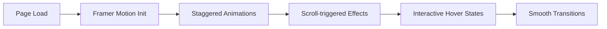

# 🚀 Chirantan Mallick - Portfolio

<div align="center">
  
  
  <h3>🎯 Full Stack Developer & AI/ML Enthusiast</h3>
  
  [](https://reactjs.org/)
  [](https://www.typescriptlang.org/)
  [](https://tailwindcss.com/)
  [](https://www.framer.com/motion/)
  [](https://vitejs.dev/)
  [](LICENSE)
  
  [](https://chirantan-portfolio.vercel.app/)
  
  **Showcasing innovation in AI/ML, Full Stack Development, and Modern Web Technologies**
</div>

---

## 🌟 **Overview**

Welcome to my modern, interactive portfolio website built with cutting-edge technologies including React 18, TypeScript, Tailwind CSS, and Framer Motion. This portfolio showcases my journey as a Full Stack Developer and AI/ML enthusiast, featuring stunning animations, glassmorphism effects, and a fully responsive design.

### ✨ **What Makes This Portfolio Special?**

- 🎨 **Modern Glassmorphism UI**: Beautiful glass morphism effects with backdrop blur
- ⚡ **Lightning Fast**: Built with Vite for optimal performance and development experience
- 📱 **Fully Responsive**: Pixel-perfect design across all devices and screen sizes
- 🎭 **Smooth Animations**: Powered by Framer Motion for engaging user interactions
- 🔍 **Interactive Certificates**: Click-to-expand certificate viewer with mobile optimization
- 🎯 **Project Showcase**: Featured projects with live demos and source code links
- 🌙 **Dark Theme**: Professional dark theme with accent colors and gradients
- 📧 **Contact Integration**: Direct contact form and social media integration

---

## 🚀 **Key Features**

### 🎯 **Portfolio Sections**

| Section             | Description                                                         | Status    |
| ------------------- | ------------------------------------------------------------------- | --------- |
| 🏠 **Hero Section** | Animated introduction with typing effect and call-to-action         | ✅ Active |
| 👨‍💻 **About**        | Personal story with shining profile image and glassmorphism styling | ✅ Active |
| 🛠️ **Skills**       | Interactive skill cards with proficiency levels and technologies    | ✅ Active |
| 💼 **Experience**   | Timeline of internships, projects, and achievements                 | ✅ Active |
| 📜 **Certificates** | Interactive certificate gallery with popup modal viewer             | ✅ Active |
| 🚀 **Projects**     | Featured projects with live demos, GitHub links, and tech stacks    | ✅ Active |
| 📞 **Contact**      | Contact form integration with social media links                    | ✅ Active |
| 🎭 **My Side**      | Personal interests and creative projects showcase                   | ✅ Active |

### 🎨 **Interactive Elements**

| Feature                    | Description                                                 | Status    |
| -------------------------- | ----------------------------------------------------------- | --------- |
| 🖱️ **Custom Cursor**       | Animated cursor effects for enhanced user experience        | ✅ Active |
| 🌊 **Smooth Scrolling**    | Seamless navigation between sections with scroll animations | ✅ Active |
| 💫 **Animated Background** | Dynamic background effects with glassmorphism elements      | ✅ Active |
| 📱 **Mobile Navigation**   | Responsive hamburger menu with smooth transitions           | ✅ Active |
| 🎭 **Hover Effects**       | Interactive hover states on all interactive elements        | ✅ Active |
| 📸 **Image Optimization**  | Lazy loading and optimized images for better performance    | ✅ Active |

---

## 🛠️ **Tech Stack**

<table>
<tr>
<td align="center"><strong>Frontend Framework</strong></td>
<td align="center"><strong>Styling & Animation</strong></td>
<td align="center"><strong>Development Tools</strong></td>
<td align="center"><strong>Deployment</strong></td>
</tr>
<tr>
<td align="center">
  <br>
  <strong>React 18</strong><br>
  <small>Modern functional components with hooks</small>
</td>
<td align="center">
  <br>
  <strong>Tailwind CSS</strong><br>
  <small>Utility-first CSS framework</small>
</td>
<td align="center">
  <br>
  <strong>TypeScript</strong><br>
  <small>Type-safe development</small>
</td>
<td align="center">
  <br>
  <strong>Vercel</strong><br>
  <small>Edge deployment platform</small>
</td>
</tr>
</table>

**Additional Technologies:**

- **Framer Motion**: Advanced animations and transitions
- **Vite**: Next-generation build tool for fast development
- **PostCSS**: Advanced CSS processing and optimization
- **Lucide React**: Beautiful, customizable icon library
- **React Router**: Client-side routing for single-page application
- **Cloudinary**: Image optimization and CDN delivery

---

## 🚀 **Getting Started**

### Prerequisites

- Node.js (v18 or higher)
- npm or yarn package manager
- Git for version control

### Installation

1. **Clone the repository**

   ```bash
   git clone https://github.com/SpicychieF05/ChirantanPortfolio.git
   cd ChirantanPortfolio
   ```

2. **Install dependencies**

   ```bash
   npm install
   # or
   yarn install
   ```

3. **Start development server**

   ```bash
   npm run dev
   # or
   yarn dev
   ```

4. **Build for production**

   ```bash
   npm run build
   # or
   yarn build
   ```

5. **Preview production build**
   ```bash
   npm run preview
   # or
   yarn preview
   ```

---

## 📁 **Project Structure**

```
ChirantanPortfolio/
├── .env.example                   # Environment variables template
├── .gitignore                     # Git ignore rules
├── .nvmrc                         # Node.js version specification
├── components.json                # shadcn/ui components configuration
├── package.json                   # NPM package configuration
├── postcss.config.js              # PostCSS configuration
├── README.md                      # Project documentation
├── tailwind.config.ts             # Tailwind CSS configuration
├── tsconfig.json                  # TypeScript configuration
├── vercel.json                    # Vercel deployment configuration
├── vite.config.ts                 # Vite build configuration
│
├── client/                        # Main application directory
│   ├── index.html                 # HTML entry point
│   ├── public/                    # Static assets
│   │   └── assets/                # Images and media files
│   │       └── Logo-icon.png      # Portfolio logo
│   │
│   └── src/                       # Source code
│       ├── App.tsx                # Main React component
│       ├── index.css              # Global styles and animations
│       ├── main.tsx               # Application entry point
│       │
│       ├── components/            # Reusable React components
│       │   ├── sections/          # Page sections
│       │   │   ├── about.tsx      # About section with profile
│       │   │   ├── contact.tsx    # Contact form and information
│       │   │   ├── experience.tsx # Experience timeline & certificates
│       │   │   ├── hero.tsx       # Hero section with animations
│       │   │   ├── projects.tsx   # Featured projects showcase
│       │   │   └── skills.tsx     # Skills and technologies
│       │   │
│       │   └── ui/                # UI components
│       │       ├── animated-button.tsx    # Custom animated buttons
│       │       ├── background.tsx         # Animated background
│       │       ├── button.tsx             # Base button component
│       │       ├── card.tsx               # Card component
│       │       ├── cursor.tsx             # Custom cursor effect
│       │       ├── dialog.tsx             # Modal dialogs
│       │       ├── input.tsx              # Form input component
│       │       ├── label.tsx              # Form label component
│       │       ├── navbar.tsx             # Navigation component
│       │       ├── optimized-image.tsx    # Image optimization
│       │       ├── separator.tsx          # Visual separators
│       │       ├── sheet.tsx              # Side panels
│       │       ├── skeleton.tsx           # Loading skeletons
│       │       ├── textarea.tsx           # Form textarea
│       │       ├── toast.tsx              # Toast notifications
│       │       ├── toaster.tsx            # Toast container
│       │       ├── toggle.tsx             # Toggle switches
│       │       └── tooltip.tsx            # Tooltip component
│       │
│       ├── hooks/                 # Custom React hooks
│       │   ├── use-mobile.tsx     # Mobile device detection
│       │   ├── use-toast.ts       # Toast notification hook
│       │   └── use-typing.tsx     # Typing animation effect
│       │
│       ├── lib/                   # Utility libraries
│       │   ├── queryClient.ts     # React Query configuration
│       │   └── utils.ts           # Utility functions
│       │
│       └── pages/                 # Page components
│           ├── home.tsx           # Main portfolio page
│           └── my-side.tsx        # Personal interests page
```

---

## 🎯 **Key Workflows**

### 🎨 **Animation System**



### 📱 **Responsive Design Process**
